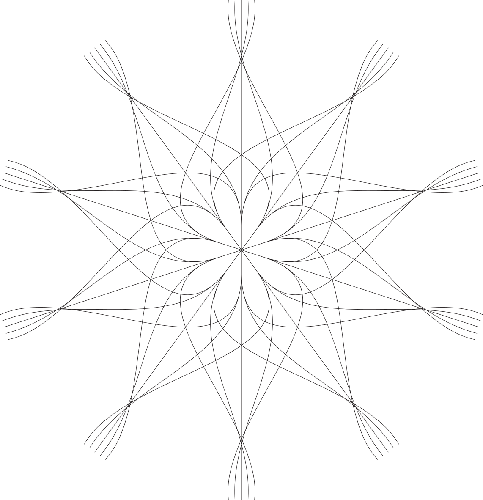
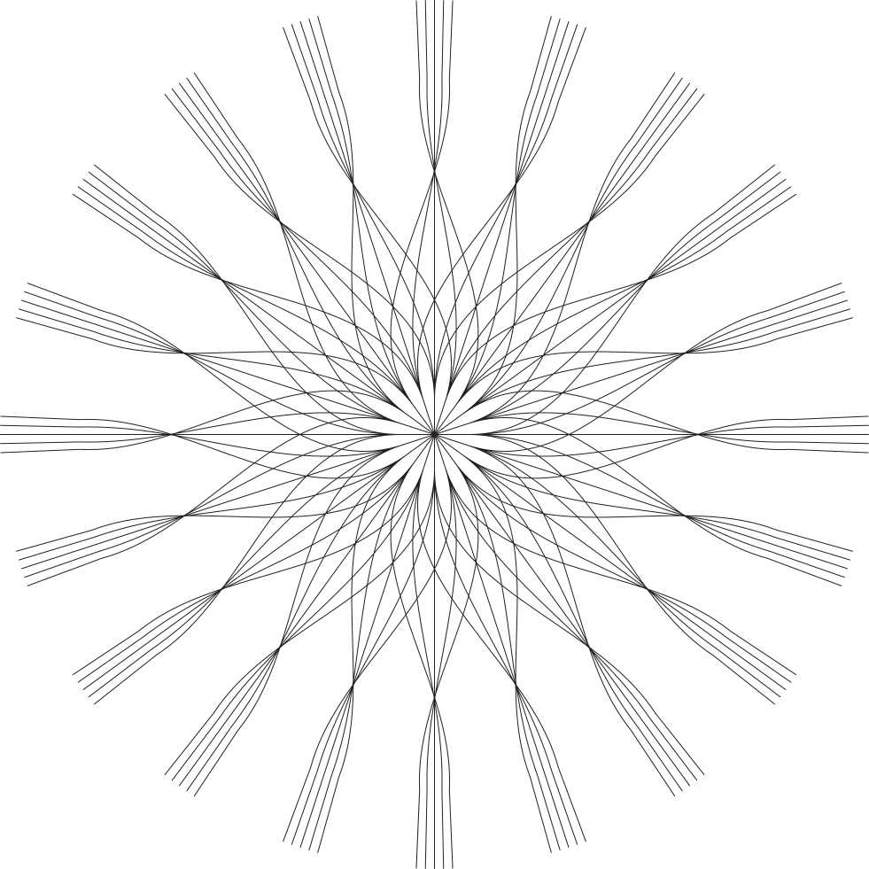

## U-Pentagram

### Big-bangs of music pentagrams

#### Algorithmic vectorial art

This program is intended to generate artistic pentagram disposition for music composition. (See samples below.)

It is also used for pure visual fine-art.

If you would like to pursue a physical composition on this series, *please get in touch for more details*.

Since it is a compositional code, I maintain the source closed. This repository is intended to be a demonstration of the project.

##### Usage:

There is included a *simple version* and *simplistic straight version for percussion* of the code. Run:

`# asy simple.asy && inkscape simple.eps`

`# asy percussion.asy && inkscape percussion.eps`

Do not forget to mess around with the files variables to get variants.

---

Copyright 2020 fde-capu

This is autorial and original work. Nothing can be done without my consent. Source code is closed and may be opened upon personal request under confidentiality terms.

---

#### Samples

